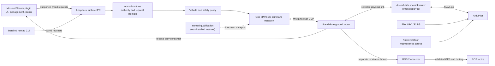

# Architecture

This document describes the system present at the current branch tip. NOMAD's
production command path is a persistent C++ runtime with local typed clients.
ArduPilot remains responsible for stabilization, EKF, navigation execution and
its own failsafes. The [qualification status](qualification.md) separates tested
software and SITL behavior from aircraft-wide guarantees.

## Current command and observation paths

Mission Planner's plugin connects to runtime IPC for the supported requests. Its
native telemetry connection can use the router's receive-only
`mission_planner` consumer; the plugin also observes the router through its
separate loopback management endpoint. The installed CLI has no aircraft
endpoint or direct-transport mode. Both clients fail closed when the runtime or
authority is unavailable. Unsupported runtime-v1 requests, including
GuidedGoto, report unavailable without a direct MAVLink fallback.

The diagram shows the ground-station route. The standalone ground router owns
ground physical links and forwards traffic; it does not approve a flight action.
The aircraft-side `mavlink-router` is a separate service that can forward
flight-controller serial/IP traffic on an onboard host. One is not a replacement
for the other. The ground router's `mission_planner` consumer is receive-only,
but its local consumer ID is not authenticated identity and does not arbitrate
other network sources.

ROS 2 is an observation-only adapter. It receives a separate MAVLink telemetry
feed because runtime IPC v1 does not expose the source measurements needed for
its GPS and battery messages. It has no command topics or services, no VIO
submission path and no direct `Vehicle` connection. A future ROS request surface
would require a deliberately added typed runtime request and its own authority,
validation and qualification; it is not part of the current architecture.

`nomad-qualification` is built explicitly for deterministic transport tests and
SITL. It is excluded from the installed package and default production build.
Integrated product profiles inhibit this direct test tool. Do not use it as an
operator CLI.

## Runtime and authority boundary

OS service managers own process lifecycle: foreground systemd on Linux and native
SCM on Windows, with console mode retained. Supervisors load protected external
configuration and apply bounded crash recovery; they never admit clients or
restore vehicle ownership. Runtime lifecycle projects existing IPC/audit/session/
heartbeat state. Router ownership remains independent, with no dependency that
restarts it alongside runtime. Mission Planner's loopback IPC requires a Windows
runtime on the same host; onboard Linux placement supports local clients. See
the [deployment matrix](operations.md#supported-deployment-matrix).

`nomad-runtime` owns one long-lived MAVSDK connection and one `Vehicle`. It
serves versioned JSON Lines IPC on IPv4 loopback, `127.0.0.1:14611` by default.
The installed `nomad` CLI and the Mission Planner plugin send typed requests to
that process; each accepted request calls an existing core operation. Runtime
v1 does not expose generic MAVLink commands, navigation requests, mission
execution, velocity, fence transfer or payload release through IPC.

The runtime starts with no admitted software source. Admission binds a client to
the current runtime incarnation and vehicle session. Mutations also carry the
authority generation, source, increasing sequence and short expiry. Revoke and
explicit handback advance the generation; reconnect, cache eviction or runtime
restart cannot restore an old owner or replay an old mutation. Mutating requests
are serialized and a concurrent request can return `busy`. See the full
[runtime IPC contract](runtime-ipc.md).

The local `NOMAD_API_KEY` requirement is a nonempty actuation gate. Per-client
shared-secret credentials authenticate local IPC identity separately; authentication
does not grant software authority. A runtime-owned durable journal records
intent before vehicle execution and observed outcomes. Audit failure inhibits
mutations. See [runtime IPC](runtime-ipc.md#authenticated-local-clients).
IPC is loopback-only; credential confidentiality relies on host access control. One
admitted source is a software boundary for typed requests to this runtime, not a
whole-aircraft single-writer guarantee. Native Mission Planner controls, pilot
and RC/ELRS input, ArduPilot behavior, maintenance tools and unrelated MAVLink
sources remain independent. The router cannot resolve those competing
authorities. Revoke NOMAD and use the approved external procedure before
takeover; reconnection alone never performs handback.

The MAVSDK fork carries the operation admission check through `COMMAND_LONG` and
`COMMAND_INT` retry queues to the final UDP delivery gate shared with revoke,
handback and session rollover. Deterministic peer tests observe the resulting
wire frames. This fence is specific to the tested encodings and UDP path; it
does not prove aircraft response or fence every message and transport. Offboard
setpoints and fence transfers are not runtime-v1 requests and are not covered by
the final-send guarantee. TCP/serial transport delivery is not a qualified
integrated command path.

## MAVSDK connection resource lifetime

The persistent connection owns one published bundle: the selected `System`,
Action, Telemetry, MAVLink Passthrough, Geofence, Param and Offboard plugins,
and their nine persistent subscription handles. Candidate construction and
subscription run before publication, outside the resource lifetime lock.
An exclusive section publishes the complete bundle and establishes its
vehicle session. Status and command methods hold the shared lifetime lock while
using resources; command methods retain it through completion as before.
The immutable configured system ID and autopilot component identify every bundle.

Connect/disconnect writers serialize on a separate lifecycle mutex. Discovery
and identity waits can delay another lifecycle writer, but never hold the
resource lifetime lock or prevent startup IPC from answering HELLO/STATUS.
Retirement takes the exclusive lifetime lock after existing command users finish,
revokes the bundle's callback gate, detaches the bundle, rolls the session and
clears observations. Unsubscription, plugin destruction and endpoint removal
then run outside the lifetime lock. No new reader or command can obtain the
retired bundle after detachment.

MAVSDK unsubscription does not drain callbacks already copied to its user queue.
Each persistent callback captures a shared gate, acquires its mutex and checks
the owner before accessing connection state. Retirement clears that owner under
the same mutex, waiting for entered callbacks. Late callbacks remain inert even
after a replacement bundle or connection destruction. Candidate callbacks are
inactive until publication. Temporary version/fence callbacks already own their
local result state and do not capture the connection.

Nested locks follow lifecycle -> resource lifetime -> callback gate -> observation
-> runtime authority -> audit journal. Callbacks never acquire lifecycle/resource
locks. Runtime copies transport state before acquiring authority locks. Existing
final-send admission, retry cancellation and session fencing remain in place.
IPC availability, vehicle readiness and software authority remain distinct
through discovery, reconnect and shutdown. Publication/retirement retain the
existing synchronous session notification and audit ordering; callback drainage
and durable audit latency can delay readers, without discovery or MAVSDK waits
under the exclusive lifetime lock.

## Component ownership

| Component | Owns | Does not own |
|---|---|---|
| C++ core (`include/nomad/`, `src/`) | Reusable vehicle state, command validation, aircraft-class and operation policy, safety checks, payload interlocks and verified outcomes | UI rendering, ROS types, packet packing outside the MAVLink implementation |
| Runtime (`tools/runtime/`, `src/runtime/`) | Long-lived `Vehicle`/MAVSDK composition, local IPC, request admission, authority lifecycle and client outcomes | Pilot/native-GCS arbitration, remote authentication, persistent mission execution |
| MAVSDK boundary and pinned fork (`src/mavlink/`, `third_party/MAVSDK/`) | One production MAVLink transport, MAVSDK calls and reviewed ArduPilot command semantics | Mission choices, NOMAD policy or proof of physical outcomes |
| Mission Planner (`mission_planner/src/`) | Operator UI, status, configuration, router management and supported typed runtime requests | Parallel policy or a fallback vehicle-command path for those requests |
| ROS (`ros2/nomad_ros/`) | Validated receive-only GPS and battery observations | Vehicle commands, VIO submission, mission decisions or actuation |
| Ground router (`infra/transport/ground_router/`, distributed Windows host) | Physical ground links, routing, link health and safe link selection | Flight authorization, command validation or aircraft-wide arbitration |
| Aircraft-side router (`infra/transport/mavlink_router/`) | Serial/IP forwarding on the aircraft-side host | The standalone ground router's multi-link selection or NOMAD policy |
| Qualification tooling (`tests/`, `scripts/dev/`) | Fake peers, deterministic wire fixtures and isolated SITL scenarios | Installed production operation or evidence beyond each test's declared scope |

## Where a change belongs

- Put reusable aircraft behavior, validation and safety policy in the C++ core;
  add focused fake-transport tests in `tests/`.
- Put new client-visible commands behind an explicit, typed runtime IPC request.
  Update the runtime contract, CLI or Mission Planner translation, admission
  tests and failure behavior together. Do not add a client-side MAVLink
  fallback.
- Put Mission Planner rendering and operator interaction in
  `mission_planner/src/`; keep vehicle decisions in the core/runtime.
- Put ROS telemetry translation in `ros2/nomad_ros/`. Do not add command
  interfaces without a reviewed runtime request and explicit qualification.
- Put link parsing, transport selection and failover in the standalone ground
  router. Do not put flight-action authorization there.
- Keep MAVLink/ArduPilot wire semantics in the MAVSDK implementation or its
  pinned fork. Preserve the dependency pin, license notices and tests described
  in [MAVSDK dependencies](mavsdk-dependencies.md).
- Competition-specific server, traffic and scoring behavior belongs in a
  future opt-in application adapter, not the reusable vehicle core. Its current
  external contract and open work are documented in
  [AEAC 2027 integration](aeac-2027.md).

## Profiles and further detail

The repository provides `onboard_companion`, `groundstation_gpu` and
`groundstation_minimal` configuration templates. A profile describes compute
placement and endpoint settings; passing profile tests does not qualify its
hardware, sensor chain or flight behavior. Optional ROS, video and GPU services
remain disabled in the templates until their providers are selected and
qualified. See [operations](operations.md) for current process/configuration
ownership and [development](development.md) for build and test workflows.
